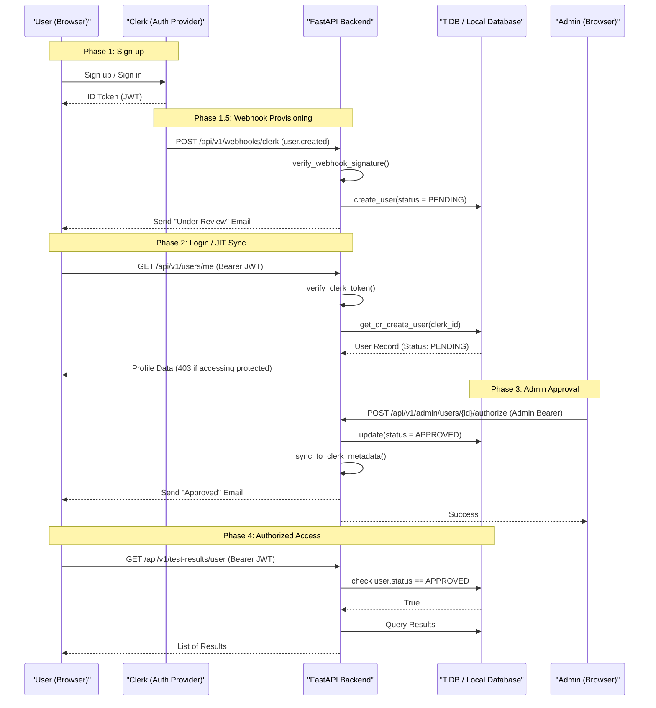

# Authentication & Authorization Flow

The following sequence details how a user joins the platform, gets authorized by an admin, and accesses protected resources.

### Production Security Hardening

The backend implements several production-grade security measures to ensure high availability and prevent unauthorized access:

- **JWKS Key Rotation Support**: The API caches Clerk's JSON Web Key Set (public keys) with a 1-hour TTL. If a token verification fails due to an unknown key (common when Clerk rotates keys), the backend automatically triggers a one-time fresh fetch of the JWKS and retries the verification.
- **Issuer Validation**: The backend strictly validates the `iss` (issuer) claim in the JWT against the configured `CLERK_ISSUER_URL`. This ensures that tokens issued from other Clerk instances cannot be used to authenticate against this backend.
- **Webhook-First Provisioning**: While it supports "Just-in-Time" provisioning as a fallback, the system is designed to create user records immediately upon signup via Clerk Webhooks. This allows for immediate "Under Review" notifications.
- **Expressive Status Machine**: Uses a `UserStatus` Enum (`PENDING`, `APPROVED`, `REJECTED`) instead of a simple boolean. This allows the system to explicitly block rejected users with custom messaging.
- **Clerk Metadata Sync**: Local approval states are synchronized back to Clerk's `public_metadata`. This enables the frontend to implement route guards based on the Clerk user object without additional backend roundtrips.
- **Transactional Notifications**: Triggered on signup, approval, and rejection to keep the user informed of their access status.
- **Sanitized Error Responses**: Authentication failure details (such as raw JWT parsing errors) are logged internally but hidden from the end user to prevent information leakage.
- **Bootstrapping**: The very first user to log in to a fresh database is automatically promoted to an Admin and Approved status to allow for initial system setup.
